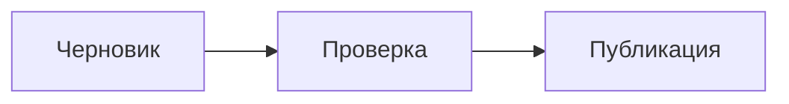

# Диаграммы Mermaid и формулы KaTeX

Mermaid и KaTeX подключаются как опциональные Markdown-интеграции. Тема
сохраняет пользовательский `markdown.config` VitePress, поэтому менять Neptu
для этого не нужно.

## Mermaid

Установите renderer и сам Mermaid:

```bash
pnpm add -D vitepress-plugin-mermaid mermaid
```

В `.vitepress/config.ts` оберните уже собранный конфиг Neptu:

```ts
import { withMermaid } from 'vitepress-plugin-mermaid'
import { defineBlogConfig } from 'vitepress-theme-neptu/configs'

export default async () => {
  const config = {
    // существующий конфиг Neptu
  }

  return withMermaid(await defineBlogConfig(config))
}
```

После этого используйте обычный fenced block:

````md

````

`withMermaid` должен оставаться внешней обёрткой, чтобы добавить свои хуки
VitePress. Параметры и совместимость версий приведены в
[репозитории плагина](https://github.com/emersonbottero/vitepress-plugin-mermaid).

## KaTeX

Установите Markdown-it plugin и KaTeX:

```bash
pnpm add -D @mdit/plugin-katex katex
```

Зарегистрируйте его через существующий Markdown hook VitePress:

```ts
import { katex } from '@mdit/plugin-katex'

const config = {
  markdown: {
    config(md) {
      md.use(katex)
    },
  },
  // остальная конфигурация Neptu
}
```

Один раз импортируйте стили в `.vitepress/theme/index.ts`:

```ts
import 'katex/dist/katex.min.css'
```

Строчные и блочные формулы используют разделители `$` и `$$`:

```md
Формула Эйлера: $e^{i\pi}+1=0$.

$$
x = {-b \pm \sqrt{b^2-4ac} \over 2a}
$$
```

Полнотекстовый feed намеренно обрабатывает безопасный стандартный Markdown,
но не запускает произвольные плагины VitePress и Vue-компоненты. Поэтому без
собственного feed transformer диаграммы и формулы останутся в ленте исходным
текстом.

Рецепт KaTeX основан на
[документации `@mdit/plugin-katex`](https://mdit-plugins.github.io/katex.html).
Если KaTeX не обязателен, VitePress также документирует встроенное опциональное
[подключение MathJax](https://vitepress.dev/ru/guide/markdown#math-equations).
