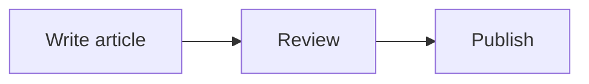

Articles in the Neptu blog support standard **Markdown** syntax, **VitePress** extensions, and the theme's built-in media components.

This guide collects all available formatting elements with a visual demonstration of how each element looks on the page, along with source code examples.

---

## Basic Markdown syntax

### Headings

Use `#` symbols at the beginning of a line to create headings of different levels.

**How to write:**

```md
# H1 heading
## H2 heading
### H3 heading
#### H4 heading
##### H5 heading
###### H6 heading
```

### Text formatting

You can make text bold, italic, strikethrough, or use monospace inline code.

**Output:**

This is **bold text**, this is *italic text*, and this is ~~strikethrough text~~. You can also do ***bold italic*** and `inline code`.

**How to write:**

```md
This is **bold text**, this is *italic text*, and this is ~~strikethrough text~~.
You can also do ***bold italic*** and `inline code`.
```

### Blockquotes

A blockquote is created with the `>` symbol. Multi-line and nested quotes are supported.

**Output:**

> Good design is as little design as possible.
>
> — Dieter Rams

**How to write:**

```md
> Good design is as little design as possible.
>
> — Dieter Rams
```

### Lists

Unordered, ordered, and task lists (with checkboxes) are supported.

**Output:**

Unordered list:
- First item
- Second item
  - Nested item
  - Another nested item

Ordered list:
1. Step one
2. Step two
3. Step three

Task list:
- [x] Create a Neptu project
- [x] Choose a theme preset
- [ ] Publish the first article

**How to write:**

```md
Unordered list:
- First item
- Second item
  - Nested item
  - Another nested item

Ordered list:
1. Step one
2. Step two
3. Step three

Task list:
- [x] Create a Neptu project
- [x] Choose a theme preset
- [ ] Publish the first article
```

### Links

Links can be internal, external, and autolinks.

**Output:**

- [Internal link to Getting started](../posts/getting-started)
- [External link to VitePress](https://vitepress.dev)
- Autolink: <https://github.com>

**How to write:**

```md
- [Internal link to Getting started](../posts/getting-started)
- [External link to VitePress](https://vitepress.dev)
- Autolink: <https://github.com>
```

### Images

Images in Markdown are lazy-loaded and automatically become clickable — clicking opens a fullscreen lightbox with zoom.

**Output:**


**How to write:**

```md

```

### Tables

Tables support text alignment in columns (left, center, right).

**Output:**

| Component | Description | Status |
| :--- | :---: | ---: |
| TopBar | Top navigation bar | Active |
| SideBar | Sidebar | Active |
| NeptuFooter | Page footer | Enabled |

**How to write:**

```md
| Component | Description | Status |
| :--- | :---: | ---: |
| TopBar | Top navigation bar | Active |
| SideBar | Sidebar | Active |
| NeptuFooter | Page footer | Enabled |
```

### Dividers and footnotes

**Output:**

Text before a horizontal rule.

---

Text with a footnote[^1].

[^1]: This is footnote text that automatically appears at the bottom of the page.

**How to write:**

```md
Text before a horizontal rule.

---

Text with a footnote[^1].

[^1]: This is footnote text that automatically appears at the bottom of the page.
```

---

## Custom containers

The Neptu theme and VitePress provide convenient visual blocks for notes, tips, warnings and collapsible sections.

### Tip (`tip`)

::: tip Tip of the day
Use the `::: tip` syntax to display helpful recommendations and lifehacks.
:::

**How to write:**

````md
::: tip Tip of the day
Use the `::: tip` syntax to display helpful recommendations and lifehacks.
:::
````

### Info (`info`)

::: info Reference information
The `::: info` block is intended for references, additional explanations and contextual information.
:::

**How to write:**

````md
::: info Reference information
The `::: info` block is intended for references, additional explanations and contextual information.
:::
````

### Note (`note`)

::: note Note
The `::: note` block highlights important details about how the system or plugins work.
:::

**How to write:**

````md
::: note Note
The `::: note` block highlights important details about how the system or plugins work.
:::
````

### Warning (`warning`)

::: warning Warning
The `::: warning` block warns the user about potential problems or pitfalls.
:::

**How to write:**

````md
::: warning Warning
The `::: warning` block warns the user about potential problems or pitfalls.
:::
````

### Danger / Caution (`danger` and `caution`)

::: danger Error / Destructive action
The `::: danger` block informs about critical errors or dangerous operations.
:::

::: caution Caution
The `::: caution` block warns about operations that require special attention.
:::

**How to write:**

````md
::: danger Error / Destructive action
The `::: danger` block informs about critical errors or dangerous operations.
:::

::: caution Caution
The `::: caution` block warns about operations that require special attention.
:::
````

### Collapsible block (`details`)

::: details Click to expand the detailed list
Inside the collapsible accordion block you can place any Markdown syntax:
- Lists and tables
- Code blocks and quotes
- Images
:::

**How to write:**

````md
::: details Click to expand the detailed list
Inside the collapsible accordion block you can place any Markdown syntax:
- Lists and tables
- Code blocks and quotes
- Images
:::
````

---

## Code blocks and their features

### Syntax highlighting and file title

In square brackets after the language name, you can specify a filename `[filename.ts]`:

```ts [src/siteConfig.ts]
export interface SiteConfig {
  title: string
  description: string
  lang: string
}
```

**How to write:**

````md
```ts [src/siteConfig.ts]
export interface SiteConfig {
  title: string
  description: string
  lang: string
}
```
````

### Line highlighting and numbering

You can highlight specific lines with `{2,4-5}` and enable line numbering with `:line-numbers`:

```ts {2,4-5} :line-numbers
function calculateTotal(price: number, quantity: number): number {
  const tax = price * 0.2
  const subtotal = price * quantity
  const total = subtotal + tax * quantity
  return total
}
```

**How to write:**

````md
```ts {2,4-5} :line-numbers
function calculateTotal(price: number, quantity: number): number {
  const tax = price * 0.2
  const subtotal = price * quantity
  const total = subtotal + tax * quantity
  return total
}
```
````

### Code groups (tabs)

The `::: code-group` syntax combines multiple code blocks into convenient switchable tabs.

::: code-group

```bash [pnpm]
pnpm add vitepress-theme-neptu
```

```bash [npm]
npm install vitepress-theme-neptu
```

```bash [yarn]
yarn add vitepress-theme-neptu
```

:::

**How to write:**

````md
::: code-group

```bash [pnpm]
pnpm add vitepress-theme-neptu
```

```bash [npm]
npm install vitepress-theme-neptu
```

```bash [yarn]
yarn add vitepress-theme-neptu
```

:::
````

---

## Badges

The `<Badge>` component lets you add neat colored pills in text or headings.

**Output:**

- Info: <Badge type="info" text="Info" />
- Tip / Success: <Badge type="tip" text="v2.0" />
- Warning: <Badge type="warning" text="Beta" />
- Danger: <Badge type="danger" text="Deprecated" />

**How to write:**

```md
- Info: <Badge type="info" text="Info" />
- Tip / Success: <Badge type="tip" text="v2.0" />
- Warning: <Badge type="warning" text="Beta" />
- Danger: <Badge type="danger" text="Deprecated" />
```

---

## Built-in Neptu media components

The Neptu theme registers ready-made Vue components available in all articles without manual import.

### YouTube video (`YouTubeVideo`)

<YouTubeVideo id="dQw4w9WgXcQ" />

**How to write:**

```html
<YouTubeVideo id="dQw4w9WgXcQ" />
```

### Audio and video player (`AudioFile` and `VideoFile`)

<AudioFile url="https://www.w3schools.com/html/horse.mp3" filename="Example audio (horse.mp3)" />

**How to write:**

```html
<AudioFile url="https://example.com/audio.mp3" filename="Example audio (MP3)" />
<VideoFile url="/media/sample-video.mp4" filename="Example video (MP4)" />
```

### File download (`FileDownload`)

<FileDownload url="https://www.w3.org/WAI/WCAG21/wcag21.pdf" filename="WCAG 2.1 Specification (PDF)" />

**How to write:**

```html
<FileDownload url="https://example.com/archive.zip" filename="Source code archive" />
```

---

## Additional integrations

### Mermaid diagrams

To create diagrams and charts, connect the `vitepress-plugin-mermaid` plugin (see [Mermaid diagrams and KaTeX formulas](./mermaid-and-katex)):

````md

````

### KaTeX formulas

For mathematical formulas, register `@mdit/plugin-katex`:

```md
Euler's formula: $e^{i\pi} + 1 = 0$

$$
x = {-b \pm \sqrt{b^2-4ac} \over 2a}
$$
```

---

## Summary

Use the full arsenal of Markdown and custom containers to create meaningful and aesthetic content. All blocks and containers automatically support both light and dark modes of the Neptu theme!

---

Next: [Frontmatter fields](./frontmatter)
