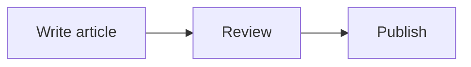

Mermaid diagrams and KaTeX formulas are optional Markdown extensions. They're not included by default — install and configure them only if you need them.

## Mermaid diagrams

### Installation

```bash
npm install vitepress-plugin-mermaid
```

### Configuration

```ts
// .vitepress/config.ts
import { withMermaid } from 'vitepress-plugin-mermaid'

export default withMermaid({
  // your VitePress / Neptu config
  mermaid: {
    // Mermaid.js options
    theme: 'default',
  },
})
```

### Usage

````md

````

## KaTeX formulas

### Installation

```bash
npm install @mdit/plugin-katex
```

### Configuration

```ts
// .vitepress/config.ts
import { katex as katexPlugin } from '@mdit/plugin-katex'

export default async () => defineBlogConfig({
  markdown: {
    config(md) {
      md.use(katexPlugin)
    },
  },
})
```

### Import styles

```css
/* .vitepress/theme/styles.css */
@import 'katex/dist/katex.css'
```

### Usage

```md
Euler's formula: $e^{i\pi} + 1 = 0$

$$
x = {-b \pm \sqrt{b^2-4ac} \over 2a}
$$
```

Inline formulas use `$...$`, block formulas use `$$...$$`.

## Troubleshooting

### Mermaid not rendering

- Ensure `withMermaid` wraps your config
- Check that the mermaid code block uses `mermaid` as the language
- Verify the diagram syntax at [mermaid.live](https://mermaid.live)

### KaTeX not rendering

- Ensure the CSS import is in your `styles.css`
- Check for conflicting `$` signs in your markdown (escape with `\$`)
- Verify formula syntax at [katex.org](https://katex.org)

## What's next

- [Markdown features](markdown-syntax) — full markdown reference
- [Customization](customization) — custom styles and CSS variables
