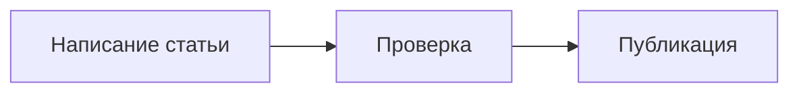

Статьи в блоге Neptu поддерживают стандартный синтаксис **Markdown**, расширения **VitePress**, а также встроенные медиа-компоненты темы.

В этом руководстве собраны все доступные элементы форматирования с наглядной демонстрацией того, как элемент выглядит на странице, и примерами исходного кода.

---

## Базовый синтаксис Markdown

### Заголовки

Используйте символы `#` в начале строки для создания заголовков разного уровня.

**Как написать:**

```md
# Заголовок уровня H1
## Заголовок уровня H2
### Заголовок уровня H3
#### Заголовок уровня H4
##### Заголовок уровня H5
###### Заголовок уровня H6
```

### Форматирование текста

Вы можете выделять текст полужирным шрифтом, курсивом, зачёркивать его или использовать моноширинный инлайн-код.

**Отображение:**

Это **полужирный текст**, это *курсивный текст*, а это ~~зачёркнутый текст~~. Также можно делать ***полужирный курсив*** и `встроенный код`.

**Как написать:**

```md
Это **полужирный текст**, это *курсивный текст*, а это ~~зачёркнутый текст~~.
Также можно делать ***полужирный курсив*** и `встроенный код`.
```

### Цитаты

Блок цитаты создаётся с помощью символа `>`. Поддерживается многострочность и вложенные цитаты.

**Отображение:**

> Хороший дизайн — это как можно меньше дизайна.
>
> — Дитер Рамс

**Как написать:**

```md
> Хороший дизайн — это как можно меньше дизайна.
>
> — Дитер Рамс
```

### Списки

Поддерживаются маркированные, нумерованные и списки задач (с чекбоксами).

**Отображение:**

Маркированный список:
- Первый пункт
- Второй пункт
  - Вложенный пункт
  - Ещё один вложенный пункт

Нумерованный список:
1. Шаг первый
2. Шаг второй
3. Шаг третий

Список задач:
- [x] Создать проект на Neptu
- [x] Выбрать тему оформления
- [ ] Опубликовать первую статью

**Как написать:**

```md
Маркированный список:
- Первый пункт
- Второй пункт
  - Вложенный пункт
  - Ещё один вложенный пункт

Нумерованный список:
1. Шаг первый
2. Шаг второй
3. Шаг третий

Список задач:
- [x] Создать проект на Neptu
- [x] Выбрать тему оформления
- [ ] Опубликовать первую статью
```

### Ссылки

Ссылки могут быть внутренними, внешними и автоссылками.

**Отображение:**

- [Внутренняя ссылка на Запуск за 5 минут](../posts/getting-started)
- [Внешняя ссылка на сайт VitePress](https://vitepress.dev)
- Автоссылка: <https://github.com>

**Как написать:**

```md
- [Внутренняя ссылка на Запуск за 5 минут](../posts/getting-started)
- [Внешняя ссылка на сайт VitePress](https://vitepress.dev)
- Автоссылка: <https://github.com>
```

### Изображения

Картинки в Markdown лениво загружаются и автоматически становятся кликабельными — нажатие открывает полноэкранный лайтбокс с зумом.

**Отображение:**


**Как написать:**

```md

```

### Таблицы

Таблицы поддерживают выравнивание текста в колонках (по левому краю, по центру, по правому краю).

**Отображение:**

| Компонент | Описание | Состояние |
| :--- | :---: | ---: |
| TopBar | Верхняя панель навигации | Активен |
| SideBar | Боковая колонка | Активен |
| NeptuFooter | Подвал страницы | Включён |

**Как написать:**

```md
| Компонент | Описание | Состояние |
| :--- | :---: | ---: |
| TopBar | Верхняя панель навигации | Активен |
| SideBar | Боковая колонка | Активен |
| NeptuFooter | Подвал страницы | Включён |
```

### Разделители и Сноски

**Отображение:**

Текст до разделительной линии.

---

Текст с указанием сноски[^1].

[^1]: Это текст сноски, который автоматически выводится внизу страницы.

**Как написать:**

```md
Текст до разделительной линии.

---

Текст с указанием сноски[^1].

[^1]: Это текст сноски, который автоматически выводится внизу страницы.
```

---

## Специальные контейнеры (Custom Containers)

Тема Neptu и VitePress предоставляют удобные визуальные блоки для заметок, советов, предупреждений и свертываемых разделов.

### Совет (`tip`)

::: tip Совет дня
Используйте специальный синтаксис `::: tip` для вывода полезных рекомендаций и лайфхаков.
:::

**Как написать:**

````md
::: tip Совет дня
Используйте специальный синтаксис `::: tip` для вывода полезных рекомендаций и лайфхаков.
:::
````

### Информация (`info`)

::: info Справочная информация
Блок `::: info` предназначен для справок, дополнительных пояснений и контекстной информации.
:::

**Как написать:**

````md
::: info Справочная информация
Блок `::: info` предназначен для справок, дополнительных пояснений и контекстной информации.
:::
````

### Заметка (`note`)

::: note Примечание
Блок `::: note` выделяет важные детали работы системы или плагинов.
:::

**Как написать:**

````md
::: note Примечание
Блок `::: note` выделяет важные детали работы системы или плагинов.
:::
````

### Предупреждение (`warning`)

::: warning Внимание
Блок `::: warning` предупреждает пользователя о потенциальных проблемах или подводных камнях.
:::

**Как написать:**

````md
::: warning Внимание
Блок `::: warning` предупреждает пользователя о потенциальных проблемах или подводных камнях.
:::
````

### Опасность / Критично (`danger` и `caution`)

::: danger Ошибка / Деструктивное действие
Блок `::: danger` информирует о критических ошибках или опасных операциях.
:::

::: caution Осторожно
Блок `::: caution` предупреждает об операциях, требующих особого внимания.
:::

**Как написать:**

````md
::: danger Ошибка / Деструктивное действие
Блок `::: danger` информирует о критических ошибках или опасных операциях.
:::

::: caution Осторожно
Блок `::: caution` предупреждает об операциях, требующих особого внимания.
:::
````

### Сворачиваемый блок (`details`)

::: details Нажмите, чтобы развернуть подробный список
Внутри свертываемого блока аккордеона можно размещать любой синтаксис Markdown:
- Списки и таблицы
- Блоки кода и цитаты
- Изображения
:::

**Как написать:**

````md
::: details Нажмите, чтобы развернуть подробный список
Внутри свертываемого блока аккордеона можно размещать любой синтаксис Markdown:
- Списки и таблицы
- Блоки кода и цитаты
- Изображения
:::
````

---

## Блоки кода и их возможности

### Подсветка синтаксиса и заголовок файла

В квадратных скобках после названия языка вы можете указать имя файла `[filename.ts]`:

```ts [src/siteConfig.ts]
export interface SiteConfig {
  title: string
  description: string
  lang: string
}
```

**Как написать:**

````md
```ts [src/siteConfig.ts]
export interface SiteConfig {
  title: string
  description: string
  lang: string
}
```
````

### Подсветка отдельных строк и нумерация

Вы можете подсвечивать определенные строки с помощью `{2,4-5}` и включать нумерацию строк флагом `:line-numbers`:

```ts {2,4-5} :line-numbers
function calculateTotal(price: number, quantity: number): number {
  const tax = price * 0.2
  const subtotal = price * quantity
  const total = subtotal + tax * quantity
  return total
}
```

**Как написать:**

````md
```ts {2,4-5} :line-numbers
function calculateTotal(price: number, quantity: number): number {
  const tax = price * 0.2
  const subtotal = price * quantity
  const total = subtotal + tax * quantity
  return total
}
```
````

### Группы кода (Code Groups / Вкладки)

Синтаксис `::: code-group` объединяет несколько блоков кода в удобные переключаемые вкладки.

::: code-group

```bash [pnpm]
pnpm add vitepress-theme-neptu
```

```bash [npm]
npm install vitepress-theme-neptu
```

```bash [yarn]
yarn add vitepress-theme-neptu
```

:::

**Как написать:**

````md
::: code-group

```bash [pnpm]
pnpm add vitepress-theme-neptu
```

```bash [npm]
npm install vitepress-theme-neptu
```

```bash [yarn]
yarn add vitepress-theme-neptu
```

:::
````

---

## Бейджи (Badges)

Компонент `<Badge>` позволяет добавлять аккуратные цветные плашки в текст или заголовки.

**Отображение:**

- Информационный: <Badge type="info" text="Инфо" />
- Совет / Успех: <Badge type="tip" text="v2.0" />
- Предупреждение: <Badge type="warning" text="Beta" />
- Опасность: <Badge type="danger" text="Deprecated" />

**Как написать:**

```md
- Информационный: <Badge type="info" text="Инфо" />
- Совет / Успех: <Badge type="tip" text="v2.0" />
- Предупреждение: <Badge type="warning" text="Beta" />
- Опасность: <Badge type="danger" text="Deprecated" />
```

---

## Встроенные медиа-компоненты Neptu

Тема Neptu регистрирует готовые Vue-компоненты, доступные во всех статьях без ручного импорта.

### Видео с YouTube (`YouTubeVideo`)

<YouTubeVideo id="dQw4w9WgXcQ" />

**Как написать:**

```html
<YouTubeVideo id="dQw4w9WgXcQ" />
```

### Плеер аудио и видео (`AudioFile` и `VideoFile`)

<AudioFile url="https://www.w3schools.com/html/horse.mp3" filename="Пример аудио (horse.mp3)" />

**Как написать:**

```html
<AudioFile url="https://example.com/audio.mp3" filename="Пример аудио (MP3)" />
<VideoFile url="/media/sample-video.mp4" filename="Пример видео (MP4)" />
```

### Скачивание файлов (`FileDownload`)

<FileDownload url="https://www.w3.org/WAI/WCAG21/wcag21.pdf" filename="Спецификация WCAG 2.1 (PDF)" />

**Как написать:**

```html
<FileDownload url="https://example.com/archive.zip" filename="Архив исходных кодов" />
```

---

## Дополнительные интеграции

### Диаграммы Mermaid

Для создания схем и диаграмм подключите плагин `vitepress-plugin-mermaid` (см. [Диаграммы Mermaid и формулы KaTeX](./mermaid-and-katex)):

````md

````

### Формулы KaTeX

Для математических формул зарегистрируйте `@mdit/plugin-katex`:

```md
Формула Эйлера: $e^{i\pi} + 1 = 0$

$$
x = {-b \pm \sqrt{b^2-4ac} \over 2a}
$$
```

---

## Итог

Используйте весь арсенал Markdown и специальных контейнеров для создания содержательного и эстетичного контента. Все блоки и контейнеры автоматические поддерживают как светлый, так и тёмный режим темы Neptu!
